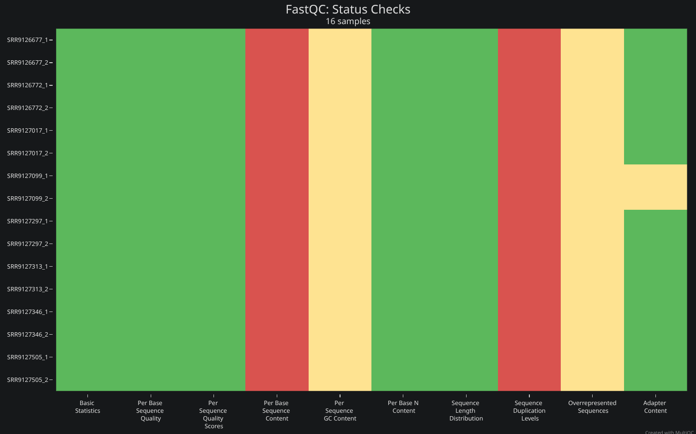
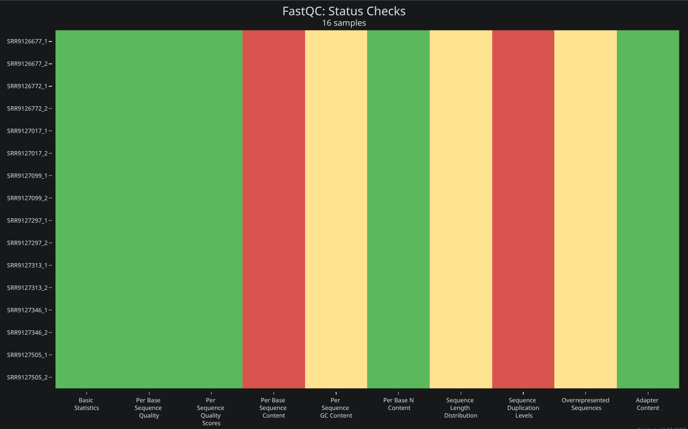
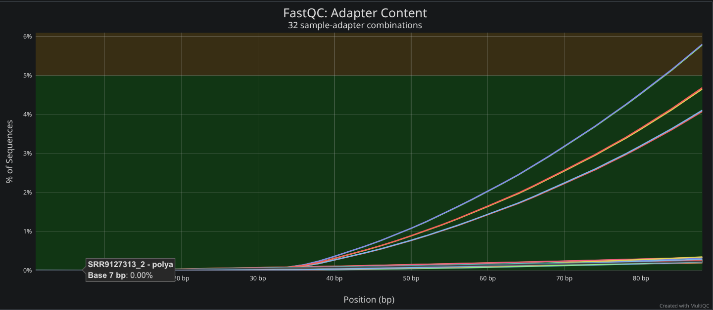
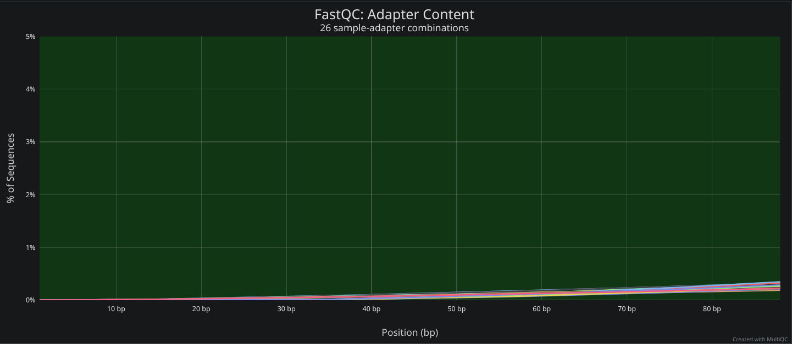

```{python Path de la tarea}
#| echo: false
#| eval: true

import os
print(f"Tarea en el path:\n{(project_path := os.getcwd())[:38]}\\ \n{project_path[38:]}")
```

> Servidor: `Chaac`

# Introducción

## Planteamiento

*Nextflow* es un motor de flujo de trabajo que permite la ejecución de *pipelines* de análisis de datos de manera **reproducible** y **escalable** (@di-tommaso-2017). Está basado en *Groovy*, un lenguaje de programación dinámico que se ejecuta sobre la máquina virtual de *Java*, lo que no solo le permite utilizar una sintaxis similar a la de lenguajes modernos, como *python*, sino que le confiere bastante flexibilidad y portabilidad (@seandavi-2020). *Nextflow* facilita la gestión de dependencias y manejo de versiones, así como la paralelización de tareas y la integración con sistemas de cómputo en la nube mediante **directivas**. En conjunto, esta herramienta es idónea para el análisis de datos genómicos a gran escala.

Los pipelines de *Nextflow* se definen en un archivo `.nf`, que contiene:

- **Funciones**: Son bloques de código auxiliares utilizados para lógica simple dentro del *script*, como manipulación de *strings* o parámetros, pero **no** forman parte del flujo de ejecución del *pipeline*.

- **Procesos**: Son las unidades básicas de ejecución en *Nextflow*. Cada proceso define una tarea específica, incluyendo sus entradas (input), salidas (output) y el bloque de código que se ejecutará.

- ***Workflows***: Definen cómo se conectan los procesos, especificando el flujo de datos entre las distintas etapas del *pipeline* y determinando qué información se transmite y cómo lo hace.

- **Canales**: Son las estructuras de datos que permiten la comunicación entre procesos, facilitando el paso de información y resultados de uno a otro. Estos se generan precisamente en los procesos o *workflows* y pueden ser nombrados mediante `emit` para facilitar su uso.

- **Directivas**: Son las configuraciones declarativas dentro de los procesos que especifican recursos computacionales como CPU y memoria, el entorno de ejecución, manejo de errores y otras condiciones que controlan cómo y dónde se ejecuta cada tarea.

- **Contenedores**: *Nextflow* permite la integración con sistemas de contenedores como *Docker* o *Singularity*, lo que facilita la gestión de dependencias y versiones de software, asegurando la reproducibilidad del análisis en distintos entornos de cómputo, sean locales o *HPC*.


## Objetivos

**Objetivo general**

- Utilizar *Nextflow* para implementar un *pipeline* que permita correr `FastQC` (@fastqc) sobre los archivos `fastq` crudos de un directorio dado, los limpie con `fastp` (@10.1093/bioinformatics/bty560) y ejecute nuevamente `FastQC` sobre los archivos limpios.

**Objetivos específicos**

- Definir un *pipeline* de análisis de datos genómicos utilizando *Nextflow*.

- Familiarizarse con la sintaxis y estructura de los archivos `.nf`.

- Implementar un flujo de trabajo reproducible y escalable con *directivas*.

- Ajustar parámetros de `fastp` en función de métricas de calidad obtenidas previamente con `FastQC`.

# Metodología y justificación

## Sintaxis y estructura de archivos `.nf`

Los *pipelines* de *Nextflow* se definen en un archivo con extensión `.nf` con la siguiente estructura:

```
// Definir funciones auxiliares
def foo_func(param) {
  // Código de la función
  <...>
  return result
}

// Definir procesos
process <process_name> {
  // Generar outputs en el wd
  publishDir <'path'>
  // Archivos o variables que toma el proceso
  input:
    path <path>
  // Canales generados --> 'emit' si quieren nombrarse
  output:
    path <'foo_output_file_1'>, emit: <channel_1_name>
    <...>
    path <'foo_output_file_n'>
  // Comandos de bash propios del proceso
  script/shell:
    """
    <bash script que genere los n outputs>
    """
}

// Definir workflows --> Auxiliares con nombre, principal sin
workflow <workflow_name>{
  // Crear canal de entrada básico
  // 'fromFilePairs' para canal según archivos con un patrón dado
  reads = Channel.fromFilePairs("<pattern>")

  // Ejecución de procesos y manejo de canales
  foo = <process_name>(reads)

  // '.out' es un iterable de los outputs del proceso
  foo_func(foo.out)

  // '.<channel_name>' para identificarlo por su nombre
  foo.out.<channel_name>

  // Enlazar procesos usando canales
  bar = <process_name>(foo.out.<channel_name>)

  // Emitir canales para su uso en otros procesos o workflows
  emit:
    <channel_name> = bar.out
}
```

> Ejemplo general de la estructura de un archivo `.nf` con funciones auxiliares, procesos y workflows. Se incluyen directivas, manejo de inputs/outputs y uso de `emit` para nombrar canales. En la práctica, la estructura puede variar según las necesidades del análisis, pero este *chunk* sirve como guía básica para organizar el código.

Adicionalmente, los *pipelines* pueden modularizarse separando los *procesos* en archivos externos independientes.

> Para los ambientes de conda, *Nextflow* crea un entorno específico para cada proceso y lo guarda en *caché* para su uso en tanto se ejecute el *workflow*.

## Estrategia

Previamente, en la tarea 1 (`./tarea_1.qmd`), se realizaron análisis de calidad antes y después de la limpieza de los archivos `fastq` con los programas `FastQC` y `MultiQC` (@Ewels_2016), y `fastp`, respectivamente.

Para el análisis de calidad, se usaron los siguientes comandos en ambas ocasiones:

```{bash}
#| echo: true
#| eval: false

fastqc –t 4 –o ./<output_dir> ./<input_dir>/*.fastq.gz
multiqc ./<out_dir>
```

Asimismo, la limpieza se hizo con el siguiente *script*:

```{bash}
#| echo: true
#| eval: false

#!/bin/bash
#$ -cwd
#$ -o data/trimmed/fastp_$JOB_ID.out
#$ -e data/trimmed/fastp_$JOB_ID.err

RAW_PATH="./data/raw"
TRIMMED_PATH="./data/trimmed"

mkdir -p $TRIMMED_PATH

LOG="${TRIMMED_PATH}/fastp_log.txt"
echo "Starting job on $(hostname)" > $LOG
echo "Date: $(date)" >> $LOG

conda activate fastp

for file in ${RAW_PATH}/SRR*_1.fastq.gz; do
  srr=$(basename "$file" _1.fastq.gz) # Solo el SRR

  # Paired End
  fastp \
    -i ${RAW_PATH}/${srr}_1.fastq.gz \
    -I ${RAW_PATH}/${srr}_2.fastq.gz \
    -o ${TRIMMED_PATH}/${srr}_1.trimmed.fastq.gz \
    -O ${TRIMMED_PATH}/${srr}_2.trimmed.fastq.gz \
    --detect_adapter_for_pe \
    --trim_poly_g \
    --cut_tail \
    --thread 8 \
    --json ${TRIMMED_PATH}/${srr}.json \
    --html ${TRIMMED_PATH}/${srr}.html
done

conda deactivate

echo "Job finished at $(date)" >> $LOG
```

Para adaptarlo a un *pipeline* de *Nextflow*, se optó por *re-definir* **un proceso por tarea**. De este modo, se busca mantener la trazabilidad de los procesos y delegar el *caching* y manejo de *inputs*/*outputs* a *Nextflow* al tiempo que se aprovecha la capacidad de **paralelización** del programa **mediante los canales**.

La tarea se puede estructurar como un *workflow* con dos procesos principales, `QC` y `CLEANING`, donde `QC` se reutiliza para evaluar tanto los datos crudos como los procesados.

## Parseo para limpieza

La idea inicial era hacer un *pipeline* que recibiera los parámetros de `fastp` a modo de argumentos, pero esto se vuelve problemático porque implica, o fragmentar el *pipeline* en dos partes a modo de *checkpoint*, primero para hacer el análisis de calidad de las lecturas crudas y luego para, con base en eso y los argumentos dados por el usuario, ejecutar la limpieza; o bien, proporcionar los parámetros de limpieza desde el inicio, lo que implicaría que se conoce la calidad de las lecturas *a priori*.

Así, dado que la otra opción sería usar parámetros estáticos, se optó por implementar un proceso intermedio que, a partir del `summary.txt` contenido en el `.zip` que genera `FastQC`, extraiga métricas de calidad relevantes y genere un archivo de texto por muestra con los parámetros de limpieza a usar en `fastp`. De este modo, aunque el usuario no puede modificar los parámetros de limpieza, estos sí se ajustan a la calidad de las lecturas crudas. Dado que las métricas de calidad pueden variar entre muestras y *Nextflow* posibilita el procesamiento de archivos de forma individual, se aplican correcciones únicamente cuando son necesarias, evitando la eliminación innecesaria de información en muestras con buena calidad y usando un criterio, si bien arbitrario, consistente, reproducible y basado en métricas objetivas.

### Criterios de corrección

Se asume que los `fastq` son datos de RNA-seq de *Illumina*, por lo que no se atienden secuencias sobrerepresentadas, niveles de duplicación o contenido de *GC*.

> Justificación conceptual más profunda puede consultarse en la tarea 1, sección de **Análisis de calidad** (`./tarea_1.qmd`).

Así, las únicas métricas de calidad que se consideran para ajustar las *flags* de limpieza sin *sobreparametrizar* son:

> Se añade el parámetro correspondiente de `fastp` si el estatus de la métrica es `WARN` o `FAIL`.

- **Adapter Content**: `--detect_adapter_for_pe`
  - Detecta y elimina adaptadores en datos *PE*.

- **Per base sequence quality**: `--cut_tail`
  - Elimina bases de baja calidad al final de las lecturas.

### Parser de python

El *script* usado es `./src/parse_fastqc.py`:

> Se usa `zipfile` para acceder al `summary.txt` del `.zip` sin descomprimir el archivo

```{python Script de python para el parseo de parámetros}
#| echo: true
#| eval: false

import argparse
import zipfile

# Argumentos
parser = argparse.ArgumentParser(
  description="Return fastp parameters based on FastQC summary.txt"
)
parser.add_argument(
  "zip",
  help="FastQC .zip file containing summary.txt for a sample"
)
args = parser.parse_args()
zip_path = args.zip

# Leer summary.txt
flags = set() # Set para evitar duplicar parámetros
might_use = ["FAIL", "WARN"]

# Abrir el archivo zip
with zipfile.ZipFile(zip_path, 'r') as zip_file:
  # Encontrar summary.txt dentro del zip
  summary_file = [
    file for file in zip_file.namelist() if file.endswith("summary.txt")
    ][0]

  # Leer summary.txt línea por línea
  with zip_file.open(summary_file) as file:
    for line in file:
      line = line.decode().strip()
      # Estatus por cada estadística
      status, statistic, _ = line.split("\t")

      # Correspondencia fastqc-fastp
      if statistic == "Adapter Content" and status in might_use:
        flags.add("--detect_adapter_for_pe")

      if statistic == "Per base sequence quality" and status in might_use:
        flags.add("--cut_tail")

# Siempre, asumiendo datos de Illumina
flags.add("--trim_poly_g")

# Output --> flags separadas por espacio
print(" ".join(sorted(flags)).strip())
```

## Pipeline

El flujo inicia con la creación de un canal de entrada a partir de los archivos fastq, los cuales se agrupan automáticamente por muestra, permitiendo distinguir entre datos single-end y paired-end según el número de archivos asociados. A partir de este canal, los procesos se encadenan mediante el paso explícito de sus salidas (`.out`/<`nombre dado en emit`>) como entradas del siguiente paso. Los resultados de `FastQC` son posteriormente procesados mediante el script auxiliar de `python`, que extrae métricas de calidad y genera parámetros de entrada para fastp, permitiendo así una limpieza *semi-dinámica* de las lecturas. Finalmente, `emit` se utiliza para exponer los resultados relevantes del *workflow* para su inspección o uso posterior.

### Módulos

El uso de módulos en *Nextflow* permite organizar el código de manera más limpia y reutilizable. En este caso, se separan los procesos `FASTQC`, `PARSE_QC`, `FASTP` y `MULTIQC` en archivos `.nf` independientes y se importan en el archivo principal. Esto no solo facilita la mantenibilidad del código, sino que permite reutilizar procesos durante el *pipeline*.

> DSL2 no permite isntanciar un proceso dos veces dentro del mismo *workflow*, por lo que más bien se importa desde un módulo bajo dos nombres diferentes.

> Aunque `fastqc`, `fastp` y `python` están disponibles en el entorno base de *Chaac*, se especifican entornos de conda con las versiones específicas de los programas disponibles por *default* en el servidor para cada proceso, asegurando reproducibilidad.

#### FastQC

`./src/fastqc.nf`:

```
// FastQC
process FASTQC {
  conda "bioconda::fastqc=0.12.1"

  input:
    val stage
    // Agrupar por muestra
    tuple val(sample_id), path(reads)

  // Mode copy para no mover los archivos originales
  publishDir "${params.outdir}/fastqc_${stage}", mode: 'copy'

  output:
    // El .zip de FastQC es el input para el proceso de parseo
    tuple val(sample_id), path("*.zip"), emit: zip

  script:
    // FastQC a todas las reads, separadas por espacio
    """
    fastqc -t 4 ${reads.join(' ')}
    """
}
```

#### Parseo de parámetros

`./src/parse_fastqc.nf`:

```
// Parseo de resultados de FastQC --> Parámetros de fastp
process PARSE_QC {
  conda "conda-forge::python=3.9"
  input:
    tuple val(sample_id), path(qc_zip)
    path parse_script

  output:
    tuple val(sample_id), path("${sample_id}.params.txt"), emit: params

  // Script auxiliar de python para parámetros dinámicos
  script:
    """
    python ${parse_script} ${qc_zip} > \
    ${sample_id}.params.txt
    """
}
```

#### Limpieza con fastp

`./src/fastp.nf`:

```
// Limpieza con fastp --> SE + PE
process FASTP {
  conda "bioconda::fastp=0.24.1"
  publishDir "${params.outdir}/trimmed", mode: 'copy'

  input:
    tuple val(sample_id), path(reads), path(param_file)

  output:
    tuple val(sample_id), path("*.trimmed.fastq.gz"), emit: reads
    path "${sample_id}.json", emit: json
    path "${sample_id}.html", emit: html

  script:
    // PE o SE según número de archivos asociados a la muestra
    def is_paired = reads.size() == 2

    def input_args = is_paired ?
      "-i ${reads[0]} -I ${reads[1]}" : "-i ${reads[0]}"

    def output_args = is_paired ?
      "-o ${sample_id}_1.trimmed.fastq.gz -O ${sample_id}_2.trimmed.fastq.gz" :
      "-o ${sample_id}.trimmed.fastq.gz"

    """
    fastp \
    ${input_args} \
    ${output_args} \
    \$(cat ${param_file}) \
    --thread 4 \
    --json ${sample_id}.json \
    --html ${sample_id}.html
    """
}
```

#### MultiQC

`./src/multiqc.nf`:

```
/ Calidad general
process MULTIQC {
  conda "bioconda::multiqc=1.33"

  input:
    val stage
    path qc_files

  publishDir "${params.outdir}/multiqc_${stage}", mode: 'copy'

  output:
    path "multiqc_report.html"

  script:
    """
    multiqc ${qc_files} -o .
    """
}
```

### Workflow

El *script* del *workflow* del *pipeline* es `./src/nextflow_QC_cleaning.nf`:

```
#!/usr/bin/env nextflow
nextflow.enable.dsl=2

// Módulos

include { FASTQC as FASTQC_RAW } from './fastqc.nf'
include { FASTQC as FASTQC_CLEAN } from './fastqc.nf'
include { PARSE_QC } from './parse_fastqc.nf'
include { FASTP } from './fastp.nf'
include { MULTIQC as MULTIQC_RAW } from './multiqc.nf'
include { MULTIQC as MULTIQC_CLEAN } from './multiqc.nf'

// Parámetros

// Input y output con valores por defecto
params.input = params.input ?: "./data/raw/*.fastq.gz"
params.outdir = params.outdir ?: "./results/nextflow"


// Workflow

workflow {
  // Canal de entrada --> PE o SE dinámicamente
  // Tupla (sample id, reads) --> Agrupado por sample id
  reads = Channel
    .fromPath(params.input, checkIfExists: true)
    .map { file ->
      def sample = file.baseName.replaceAll(/_[12]$/, "")
      tuple(sample, file)
    }
    .groupTuple()

  // FastQC inicial
  qc_raw = FASTQC_RAW("raw", reads)

  // MultiQC --> Recolecta todos los .zip de FastQC
  multiqc_raw = MULTIQC_RAW(
    "raw",
    qc_raw.zip.map { it[1] }.collect()
  )

  // Parseo de métricas → parámetros dinámicos
  parsed = PARSE_QC(qc_raw.zip, file("./src/parse_fastqc.py"))

  // Asociar params con cada muestra
  reads_with_params = reads.join(parsed)

  // Limpieza con fastp
  trimmed = FASTP(reads_with_params)

  // FastQC final
  qc_clean = FASTQC_CLEAN("clean", trimmed.reads)

  // MultiQC final
  multiqc_clean = MULTIQC_CLEAN(
    "clean",
    qc_clean.zip.map { it[1] }.collect()
  )
}
```

> El *pipeline* asume que los nombres de los archivos `fastq` siguen el formato `SRR*_1.fastq.gz` y `SRR*_2.fastq.gz` para datos *PE* y `*.fastq.gz` para *SE*.

## Pruebas

### Paired-end

Para correr el pipeline, se usa el siguiente comando:

> El input usa un patrón que incluye todos los archivos del directorio, por lo que el pipeline procesa *paired-end*.

```{bash}
#| echo: true
#| eval: false

nextflow run ./src/nextflow_QC_cleaning.nf \
  --input "./data/raw/*.fastq.gz" \
  --outdir "./results/nextflow_PE" \
  -with-conda \
  -with-report report_PE.html \
  -with-trace trace_PE.txt \
  -with-timeline timeline_PE.html
```

Y se obtiene:

```
 N E X T F L O W   ~  version 24.04.3

Launching `./src/nextflow_QC_cleaning.nf` [stupefied_rosalind] DSL2 - revision: 54e9cd60d5

executor >  local (66)
[92/68699f] process > FASTQC_RAW (12)   [100%] 16 of 16 ✔
[1c/f2ba57] process > MULTIQC_RAW       [100%] 1 of 1 ✔
[19/b25c9d] process > PARSE_QC (16)     [100%] 16 of 16 ✔
[ed/aff68d] process > FASTP (16)        [100%] 16 of 16 ✔
[84/1a0527] process > FASTQC_CLEAN (16) [100%] 16 of 16 ✔
[36/99a260] process > MULTIQC_CLEAN     [100%] 1 of 1 ✔
Completed at: 01-May-2026 21:50:09
Duration    : 7m 14s
CPU hours   : 1.5
Succeeded   : 66
```

Constatamos que los archivos de salida sean los esperados:

```{bash}
#| echo: true
#| eval: true

ls ./results/nextflow_PE && \
ls ./results/nextflow_PE/fastqc_raw | wc -l && \
ls ./results/nextflow_PE/fastqc_clean | wc -l && \
ls ./results/nextflow_PE/trimmed/*fastq.gz | wc -l && \
ls ./results/nextflow_PE/multiqc_*
```

### Single-end

Para correr el pipeline, se usa el siguiente comando:

> El input incluye solo los archivos `*_1.fastq.gz`, por lo que el pipeline procesa *single-end*.

> Dado que el pipeline ya se ejecutó con los archivos *PE* y los procesos están *cacheados*, se añade `-resume` para evitar la re-ejecución de los procesos que ya tuvieran sus outputs generados, en aras de una ejecución más rápida.

```{bash}
#| echo: true
#| eval: false

nextflow run ./src/nextflow_QC_cleaning.nf \
  --input "./data/raw/*_1.fastq.gz" \
  --outdir "./results/nextflow_SE" \
  -with-conda \
  -with-report report_SE.html \
  -with-trace trace_SE.txt \
  -with-timeline timeline_SE.html \
  -resume
```

Y se obtiene:

```
 N E X T F L O W   ~  version 24.04.3

Launching `./src/nextflow_QC_cleaning.nf` [boring_cray] DSL2 - revision: 54e9cd60d5

executor >  local (2)
[08/2f0a14] process > FASTQC_RAW (6)   [100%] 8 of 8, cached: 8 ✔
[6d/704b48] process > MULTIQC_RAW      [100%] 1 of 1 ✔
[eb/8ab0bf] process > PARSE_QC (5)     [100%] 8 of 8, cached: 8 ✔
[5f/a4f5ef] process > FASTP (2)        [100%] 8 of 8, cached: 8 ✔
[9f/da269a] process > FASTQC_CLEAN (8) [100%] 8 of 8, cached: 8 ✔
[6e/79ad24] process > MULTIQC_CLEAN    [100%] 1 of 1 ✔
```

Constatamos que los archivos de salida sean los esperados:

```{bash}
#| echo: true
#| eval: true

ls ./results/nextflow_SE && \
ls ./results/nextflow_SE/fastqc_raw | wc -l && \
ls ./results/nextflow_SE/fastqc_clean | wc -l && \
ls ./results/nextflow_SE/trimmed/*fastq.gz | wc -l && \
ls ./results/nextflow_SE/multiqc_*
```

## Resultados

> Para efectos de la tarea, se muestran los resultados de la ejecución con datos *paired-end*.







---







# Discusión

Se observa que los resultados obtenidos con el *pipeline* de *Nextflow* son consistentes con los de la tarea 1, indicando que la implementación del *pipeline* es correcta, coherente y reproducible. Asimismo y acorde a la **Tarea 1** (`./tarea_1.qmd`), las métricas de calidad antes y después de la limpieza muestran mejoras en el contenido de adaptadores, así como las mismas tendencias en los demás estadísticos, lo que indica que el proceso de limpieza se está aplicando de manera efectiva y consistente.

En términos generales y con base en los resultados obtenidos, puede decirse que *Nextflow* es una gran herramienta para homogenizar y automatizar distintos *pipelines*, facilitando su reproducibilidad y escalabilidad en distintos entornos de cómputo, lo que es especialmente relevante en el análisis de datos a gran escala, como lo son los transcriptómicos; La modularización del código mediante procesos y workflows permite una mayor flexibilidad y ofrece opciones para reutilizar el código, mientras que el manejo de dependencias y versiones mediante contenedores asegura la reproducibilidad del análisis.

En cuanto a tiempos de ejecución, por el output del pipeline *SE*, observamos que se reutilizó toda la información previamente obtenida, a excepción de los procesos de `MultiQC`, los cuales se ejecutaron nuevamente para generar reportes específicos de los archivos *SE*. El primer proceso, con *PE*, tardó 7 minutos con 14 segundos para los 66 procesos individuales.
Un aspecto interesante es que, pese a no tener el registro preciso del tiempo de ejecución del segundo proceso, es inmediatamente notorio que *Nextflow* y su capacidad de paralelización mediante canales permite una ejecución del pipeline muy veloz, siempre y cuando -como en este caso- se hayan *cacheado* ya los procesos y ambientes internos, lo que ofrece una ventaja en los análisis a gran escala.

Por los `./trace_*.txt`, podemos determinar cuánto tardó cada proceso individualmente:

> `./trace_PE.txt`

Si tomamos en cuenta los proceso ya realizados de cara al segundo *pipeline* en muestras *SE*, notamos que, efectivamente, toda la información se reutilizó. Así, el tiempo práctico de ejecución refiere a los procesos `MULTIQC_RAW` y `MULTIQC_CLEAN`:

```
task_id	hash	native_id	name	status	exit	submit	duration	realtime	%cpu	peak_rss	peak_vmem	rchar	wchar
8	c0/2bcfc4	3863339	FASTQC_RAW (15)	CACHED	0	2026-05-01 21:42:56.434	1m 51s	1m 50s	101.9%	1.3 GB	5.6 GB	972.6 MB	1.8 MB
1	8f/168539	3863318	FASTQC_RAW (1)	CACHED	0	2026-05-01 21:42:56.424	2m 21s	2m 20s	100.8%	1.3 GB	5.6 GB	1.2 GB	1.8 MB
5	b5/ecd3dd	3863235	FASTQC_RAW (9)	CACHED	0	2026-05-01 21:42:56.388	1m 30s	1m 29s	101.7%	1.4 GB	5.8 GB	751.3 MB	1.8 MB
7	cf/f99095	3863216	FASTQC_RAW (13)	CACHED	0	2026-05-01 21:42:56.370	1m 54s	1m 53s	101.4%	1.3 GB	5.8 GB	1014.8 MB	1.8 MB
4	2c/604baf	3863212	FASTQC_RAW (7)	CACHED	0	2026-05-01 21:42:56.360	2m 52s	2m 51s	99.8%	1.3 GB	5.8 GB	1.4 GB	1.8 MB
3	4c/1e2cfe	3863326	FASTQC_RAW (5)	CACHED	0	2026-05-01 21:42:56.430	2m 4s	2m 3s	101.2%	1.3 GB	5.6 GB	1 GB	1.8 MB
2	47/76de20	3863253	FASTQC_RAW (3)	CACHED	0	2026-05-01 21:42:56.397	2m 44s	2m 43s	99.6%	1.3 GB	5.6 GB	1.2 GB	1.8 MB
6	08/2f0a14	3863268	FASTQC_RAW (11)	CACHED	0	2026-05-01 21:42:56.406	2m 51s	2m 50s	100.8%	1.4 GB	5.8 GB	1.4 GB	1.7 MB
14	82/21bea4	3893503	PARSE_QC (3)	CACHED	0	2026-05-01 21:44:47.100	918ms	72ms	108.7%	0	0	1.1 MB	1.2 KB
10	9e/b11405	3912525	PARSE_QC (15)	CACHED	0	2026-05-01 21:45:48.052	948ms	74ms	101.5%	3.6 MB	217.5 MB	1.1 MB	1.2 KB
12	80/8c996e	3909988	PARSE_QC (12)	CACHED	0	2026-05-01 21:45:40.116	860ms	57ms	106.4%	0	0	1.1 MB	1.2 KB
15	48/e12694	3903764	PARSE_QC (9)	CACHED	0	2026-05-01 21:45:17.068	900ms	57ms	119.8%	0	0	1.1 MB	1.2 KB
11	81/9ae700	3888474	PARSE_QC (2)	CACHED	0	2026-05-01 21:44:26.117	1.1s	240ms	42.8%	13 MB	441.7 MB	1.1 MB	1.2 KB
9	76/ad8efe	3894250	PARSE_QC (5)	CACHED	0	2026-05-01 21:44:50.118	853ms	70ms	90.2%	0	0	1.1 MB	1.2 KB
16	79/1f8b1c	3897849	PARSE_QC (7)	CACHED	0	2026-05-01 21:45:00.087	930ms	66ms	102.9%	0	0	1.1 MB	1.2 KB
13	eb/8ab0bf	3912024	PARSE_QC (14)	CACHED	0	2026-05-01 21:45:47.049	956ms	80ms	102.6%	3.7 MB	217.5 MB	1.1 MB	1.2 KB
24	9b/ea9c29	3903990	FASTP (9)	CACHED	0	2026-05-01 21:45:17.985	1m 15s	1m 14s	280.2%	1.2 GB	1.8 GB	1.2 GB	1.2 GB
25	91/cf171c	3910213	FASTP (12)	CACHED	0	2026-05-01 21:45:40.996	1m 20s	1m 19s	273.2%	1.2 GB	1.9 GB	1.2 GB	1.3 GB
20	85/004b24	3898654	FASTP (7)	CACHED	0	2026-05-01 21:45:01.037	1m 1s	59.9s	400.9%	1.3 GB	1.8 GB	1 GB	1.1 GB
17	b3/4f0f74	3913067	FASTP (15)	CACHED	0	2026-05-01 21:45:49.028	1m 22s	1m 21s	368.8%	1.3 GB	1.9 GB	1.4 GB	1.5 GB
22	86/b2e35e	3888752	FASTP (1)	CACHED	0	2026-05-01 21:44:27.206	41.9s	41.1s	385.6%	1.3 GB	1.8 GB	757.3 MB	790.2 MB
19	aa/11af1a	3893673	FASTP (3)	CACHED	0	2026-05-01 21:44:48.043	59.5s	58.7s	275.9%	1.2 GB	1.8 GB	982.7 MB	1019.2 MB
21	b2/4e8173	3894994	FASTP (5)	CACHED	0	2026-05-01 21:44:50.998	1m 4s	1m 3s	298.3%	1.2 GB	1.8 GB	1 GB	1 GB
18	5f/a4f5ef	3912508	FASTP (14)	CACHED	0	2026-05-01 21:45:48.024	1m 27s	1m 26s	294.6%	1.2 GB	1.8 GB	1.4 GB	1.5 GB
26	00/d42a46	3933998	FASTQC_CLEAN (12)	CACHED	0	2026-05-01 21:47:00.829	2m 20s	2m 19s	101.4%	1.3 GB	5.7 GB	1.3 GB	1.8 MB
27	5f/eaffab	3916127	FASTQC_CLEAN (5)	CACHED	0	2026-05-01 21:45:54.753	2m 8s	2m 7s	102.0%	1.3 GB	5.8 GB	1 GB	1.8 MB
29	9c/fed5ed	3927384	FASTQC_CLEAN (9)	CACHED	0	2026-05-01 21:46:32.677	2m 32s	2m 31s	101.2%	1.4 GB	5.7 GB	1.2 GB	1.8 MB
31	2a/5094b3	3936310	FASTQC_CLEAN (14)	CACHED	0	2026-05-01 21:47:10.915	2m 39s	2m 38s	101.6%	1.3 GB	5.7 GB	1.5 GB	1.8 MB
30	4d/671b08	3900876	FASTQC_CLEAN (1)	CACHED	0	2026-05-01 21:45:09.092	1m 41s	1m 40s	102.8%	1.3 GB	5.8 GB	800.3 MB	1.8 MB
28	6c/5b0e7a	3912202	FASTQC_CLEAN (3)	CACHED	0	2026-05-01 21:45:47.569	2m 1s	2m	102.5%	1.3 GB	5.8 GB	1 GB	1.8 MB
32	62/9e4c64	3919724	FASTQC_CLEAN (7)	CACHED	0	2026-05-01 21:46:01.791	2m 12s	2m 11s	101.4%	1.3 GB	5.7 GB	1.1 GB	1.8 MB
33	9f/da269a	3937521	FASTQC_CLEAN (15)	CACHED	0	2026-05-01 21:47:15.371	2m 38s	2m 37s	101.3%	1.3 GB	5.7 GB	1.5 GB	1.8 MB
34	6e/79ad24	3999689	MULTIQC_CLEAN	COMPLETED	0	2026-05-01 22:25:38.006	8.4s	7.6s	146.2%	522.5 MB	22.5 GB	38 MB	6.3 MB
23	6d/704b48	3999683	MULTIQC_RAW	COMPLETED	0	2026-05-01 22:25:37.996	8.9s	8s	121.9%	138.5 MB	13.6 GB	38 MB	6.3 MB
```

Estos procesos corrieron de forma paralela y demoraron 8.4 y 8.9 segundos, respectivamente..

# Conclusiones

El *pipeline* de *Nextflow* implementado cumple con los objetivos planteados, permitiendo la ejecución reproducible y escalable de las tareas de análisis de calidad y limpieza, así como de muchos otros anális de datos, genómicos o no. Además, la modularización del código mediante procesos y workflows facilita su mantenimiento y reutilización en futuros proyectos. De cara al *pipeline* hecho, los resultados obtenidos son consistentes con los análisis realizados de forma manual en la Tarea 1 (`./tarea_1.qmd`), validando la correcta implementación del mismo, así como su capacidad para mejorar la calidad de las lecturas mediante la aplicación de los parámetros de limpieza definidos, basados en métricas objetivas extraídas de los reportes de `FastQC`.

# Referencias